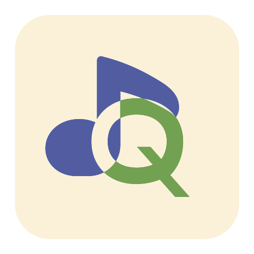

  

## Hi there 👋

*欢迎来到 Team Quaver 的组织！*

Team Quaver，是 Quaver Music, Lumine Wayland 合成器/Stella Shell 开发组所属组织

Quaver Music，是一个跨平台的，基于 Electron + Vite + Python（未来是 Go）实现的音乐客户端。主要目的是为了解决 Linux 版本 QQ 音乐难用的问题，使用 AI ~~辅助~~ Vibe 而来。

Lumine Wayland 混成器 （曾经叫 NeoFuckGNOMEWaylandCompositor or NfGW），是一个笑话，来自我对 GNOME 的厌恶，使用 C + Wlroots 构建，而与此同时，对应的 Stella Shell，使用 QML 构建，依旧使用 AI ~~辅助~~ Vibe 而来

- [Quaver Music 官网（正在建设）](https://quaver.0w0.red)
- [Lumine Wayland 合成器（曾经叫 NeoFuckGNOMEWaylandCompositor） 与 Stella Shell 官网（正在建设）](https://lumine.0w0.red)
- Quaver Music 交流群：未建设
